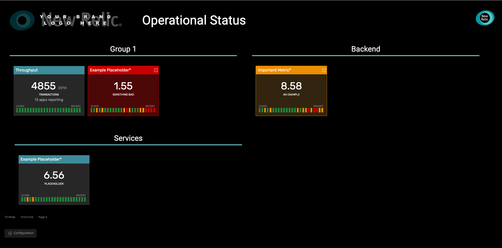

# New Relic One Wall Status Board (nr1-wall-status-board)

  

This nerdlet is designed to allow key metrics to be observed in a way that makes incidents and platform state easy to recognise and evaulate with little cognitive effort. The panels change colour based on defined thresholds and the historical state is illustrated to provide context. The nerdlet is intended to be displayed full screen on a TV on the wall and be understood at a distance -  but you can of course use it how you like.

## Features
- Fully configurable through UI (which is persistently stored by account)
- Use any NRQL query to drive widgets
- Cross account querying
- Multiple groups of widgets (in 1, 2 or 3 columns)
- Multi-page (including automated cycling through pages!)
- TV Mode
- Numeric and regex thresholds deriving warning and critical states
- Sub query support to further decorate data (extensible through code)
- CSS can be edited to style to your brand (including custom fonts and custom colours)

## Installation
 - Download repo
 - run `npm install` 
 - run `nr1 nerdpack:uuid -gf`
 - update the [config.json](/nerdlets/status-board-nerdlet/config.json) with your New Relic account ID. 
 - Serve locally `nr1 nerdpack:serve` or deploy using the `nr1` CLI.

## Configuration
All configuration is driven through the application, click the Configuration button and a form will appear below. Each field is described. Some of the more interseting settings are discussed here:

#### Default refresh rate
Each panel will auto refresh at this rate.

#### Auto rotate pages
If there is more than one page of widgets, then if this has a value > 0 then when in TV mode the pages will be cycled in turn.

#### Groups: Number of groups per row
Panels are displayed in groups. This setting allows you to determine if each group is 1 (6 panels per row), 2 (3 panels per row) or 3 (2 panels per row) columns wide.

#### Panels: Field name
When you provide your NRQL query try to alias the value you want to dusplay. This name is then used in the Field name ocnfiguration. This tells the nerdlet which field in the query to display and test against. Sometimes the field name is not what you might expect. If you have trouble enable debug mode on the panel and explore the results displayed in the console. This will show the data returned and importantly the field name applied to the value in the query. For instance in the query `SELECT apdex(duration,0.5) from Transaction` the field name is `score`.

#### Panels: Thresholds
You can provide thresholds for warning and critical states. These can either be numeric thresholds or regular expressions. You can choosew to display the value or provide an label for each state. This might be useful if the value itself is not very meaningful and a label would provide simpler cognitive effort.

#### Panels: Custom Features
An example custom feature is included called `example`. What this demonstrates is how to specify additional NRQL queries for the panel to enrich it further. For instance the demo data shows the numer of transactions for all apps, and then as an enrichment shows how many apps are reporting. Its possible to easily add extra features like this without the need to worry about the loading of data..

